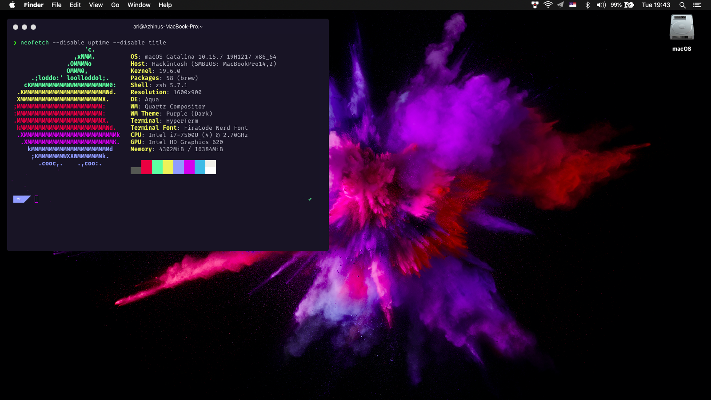

# X270-OpenCore-Hackintosh

**Status: Unmaintained (Probably)**

Sorry, I am not sure if I will update this repo.




[](https://github.com/acidanthera/OpenCorePkg)
[](https://www.apple.com/macos/catalina/)
[](https://www.apple.com/macos/big-sur)

**DISCLAIMER:**
Read the entire README and Dortania guides before you start. I am not responsible for any damage.
When you encounter bug or want to improve this repo, consider opening issue or pull request.
If you find this bootloader configuration useful, consider giving it a star to make it more visible.

## Introduction

<details>

<summary><strong>General knowledge & credits</strong></summary>
<br>

- To install macOS follow the guides provided by [Dortania](https://dortania.github.io/getting-started/).
Or simply create USB drive with macOS and put this repo to EFI partition
- Useful tools by [CorpNewt](https://github.com/corpnewt) and [headkaze](https://github.com/headkaze/Hackintool)
- [CREDITS](CREDITS.md) file

</details>

<details>

<summary><strong>Hardware</strong></summary>
<br>

[](https://pcsupport.lenovo.com/cy/en/products/laptops-and-netbooks/thinkpad-x-series-laptops/thinkpad-x270/downloads/ds120442-bios-update-utility-bootable-cd-for-windows-10-81-7-64-bit-7-32-bit-thinkpad-x270)

| Category  | Component                            | Note                                                                                                               |
| --------- | ------------------------------------ | ------------------------------------------------------------------------------------------------------------------ |
| CPU       | Intel Core i7-7500U                  | 20L50000MC                                                                                                         |
| GPU       | Intel UHD 620                        |                                                                                                                    |
| SSD       | Samsung 960 Evo 512GB                | Stock SSD doesn't work with macOS                                                            |
| Memory    | 16GB DDR4 2400Mhz                    |                                                                                                                    |
| Battery   | Dual battery                         |                                                                                                                    |
| Camera    | 720p Camera                          |                                                                                                                    |
| Wifi & BT | Intel Wireless-AC 8265               | You should use Heliport app to get WiFi GUI.                        |
| Input     | PS2 Keyboard & Synaptics TrackPad    | [YogaSMC](https://github.com/zhen-zen/YogaSMC) for media keys like microphone switch, etc. PrtSc is mapped as F13. |

</details>  

<details>
<summary><strong>Main software</strong></summary>

| Component      | Version        |
| -------------- | -------------- |
| macOS Catalina | 10.15.7 (19H2) |
| macOS Big Sur  | 11.2.2 (20D80) |
| OpenCore       | v0.7.0         |

</details>

<details>

<summary><strong>Kernel extensions</strong></summary>

| Kext                   | Version        |
|:---------------------- | -------------- |
| AppleALC               | 1.6.1          |
| BrightnessKeys         | 1.0.2          |
| CPUFriend              | 1.2.3          |
| CPUFriendDataProvider  | i5-7500U       |
| HibernationFixup       | 1.4.0          |
| IntelBluetoothFirmware | 1.1.2          |
| IntelBluetoothInjector | 1.1.2          |
| itlwm                  | 1.3.0          |
| IntelMausi             | 1.0.6          |
| Lilu                   | 1.5.3          |
| NoTouchID              | 1.0.4          |
| NVMeFix                | 1.0.8          |
| VirtualSMC             | 1.2.4          |
| VoltageShift           | 1.24           |
| Acidanthera VoodooPS2Controller| 2.2.3  |
| USBMap                 |                |
| WhateverGreen          | 1.5.0          |
| YogaSMC                | 1.5.1          |

</details>
<details>

<summary><strong>UEFI drivers</strong></summary>

| Driver          | Version           |
|:---------------:| ----------------- |
| AudioDxe.efi    | OpenCorePkg 0.7.0 |
| HfsPlus.efi     | OcBinaryData      |
| OpenCanopy.efi  | OpenCorePkg 0.7.0 |
| OpenRuntime.efi | OpenCorePkg 0.7.0 |

</details>


## Before installation

<details>  

<summary><strong>UEFI settings</strong></summary>
<br>

**Security**

- `Security Chip` **Disabled**
- `Memory Protection -> Execution Prevention` **Enabled**
- `Virtualization -> Intel Virtualization Technology` **Enabled**
- `Virtualization -> Intel VT-d Feature` **Enabled**
- `Anti-Theft -> Computrace -> Current Setting` **Disabled**
- `Secure Boot -> Secure Boot` **Disabled**
- `Intel SGX -> Intel SGX Control` **Disabled**
- `Device Guard` **Disabled**

**Startup**

- `UEFI/Legacy Boot` **UEFI Only**
- `CSM Support` **No**

</details>
<details>

<summary><strong>Secure Boot</strong></summary>
<br>
If I correctly understood, we can't use Secure Boot because it supported since MacBookPro15 but MacBookPro14 is more similar to x270 hardware.
</details>

## Post-Install
<details>
<summary><strong>CPUFriend power management</strong></summary>
<br>

Generate CPUFriendDataProvider for your machine [here](https://github.com/fewtarius/CPUFriendFriend) or use it from this repo if you have a same CPU.

</details>

<details>

<summary><strong>VoltageShift undervolt</strong></summary>
<br>

It is possible to use [VoltageShift](https://github.com/sicreative/VoltageShift) directly from the EFI folder instead of disabling SIP.

</details>

<details>

<summary><strong>ThinkPad Assistant / YogaSMC</strong></summary>
<br>

For some additional features you can use [ThinkPad Assistant app](https://github.com/MSzturc/ThinkpadAssistant) and [YogaSMC](https://github.com/zhen-zen/YogaSMC) Prefpanel and assistant app.

```
Not all functional is available. Maybe I'll fix it later
````

</details>

<details>
<summary><strong>HeliPort</strong></summary>

To use WiFi install [HeliPort app](https://github.com/OpenIntelWireless/HeliPort). You can also use modified kext to get ability to use native WiFi control, but it's not a recommended way.

</details>

## Status

<details>

<summary><strong>What's working ✅</strong></summary>

- [x] Battery percentage
- [x] Bluetooth - Intel Wireless-AC 8260
- [x] Boot chime
- [x] Boot menu `OpenCanopy`
- [x] CPU power management / performance `Now on par with Windows without XTU undervolt.`
- [x] FireVault 2 `No config.plist changes needed`
- [x] GPU UHD 620 hardware acceleration / performance
- [x] HDMI `Closed and opened lid. With audio.`
- [x] iMessage, FaceTime, App Store, iTunes Store.
- [x] Intel I219V Ethernet port
- [x] Keyboard `Volume and brightness hotkeys. Another media keys with YogaSMC.`
- [x] Microphone `With keyboard switch using ThinkPad Assistant.`
- [x] Realtek® Audio
- [x] Sleep/Wake
- [x] TouchPad. `But laggy a bit. Gestures and force touch emulation are working.`
- [x] USB Ports `For some reason, left USB port doesn't work for USB3.0.`
- [x] Web camera
- [x] Wifi - Intel Wireless-AC 8260 `Use HeliPort app for Wi-Fi control`
- [x] DRM `Widevine, validated on Chrome. WhateverGreen's DRM is broken on Big Sur`

</details>

<details>

<summary><strong>What's not working ⚠️</strong></summary>

- [ ] Fingerprint reader `There is finally after many years working driver for Linux (python-validity), don't expect macOS driver any time soon.`
- [ ] PM 981 `Didn't find any info about success with this SSD.`
- [ ] Sidecar wireless `If you want to use this feature, buy a compatible Broadcom card!`
- [ ] TrackPoint.
- [ ] Maybe something else.

</details>

<details>

<summary><strong>Untested</strong></summary>

- [ ] SD card reader.
- [ ] LTE modem.
- [ ] Sidecar wired.

</details>
<br>

### Changelog

<details>
<summary><strong>Changelog</strong></summary>
<br>

6.0 - Initial fork
  * Added X270 USBMap
  * Added X270 YogaSMC SSDT
  * AirportItlwm.kext replaced with itlwm.kext
  * Config adapted to X270
  * Config cleanup
  * Fixed keyboard mapping
  * Removed VoodooRMI (Doesnt work as good as Acidanthera implementation)
  * Removed some kexts
  * Updated kexts to latest release
  * Updated to OpenCore 7.0


</details>
